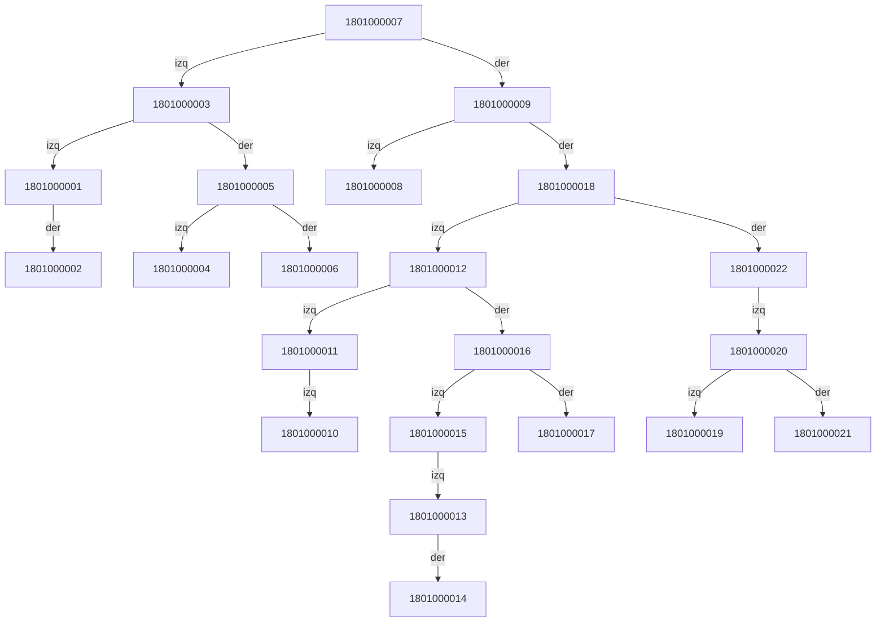

# Estado del BST

```mermaid
graph TD
    n1801000007["1801000007"]
    n1801000007 -->|izq| n1801000003
    n1801000003["1801000003"]
    n1801000003 -->|izq| n1801000001
    n1801000001["1801000001"]
    n1801000001 -->|der| n1801000002
    n1801000002["1801000002"]
    n1801000003 -->|der| n1801000005
    n1801000005["1801000005"]
    n1801000005 -->|izq| n1801000004
    n1801000004["1801000004"]
    n1801000005 -->|der| n1801000006
    n1801000006["1801000006"]
    n1801000007 -->|der| n1801000009
    n1801000009["1801000009"]
    n1801000009 -->|izq| n1801000008
    n1801000008["1801000008"]
    n1801000009 -->|der| n1801000018
    n1801000018["1801000018"]
    n1801000018 -->|izq| n1801000012
    n1801000012["1801000012"]
    n1801000012 -->|izq| n1801000011
    n1801000011["1801000011"]
    n1801000011 -->|izq| n1801000010
    n1801000010["1801000010"]
    n1801000012 -->|der| n1801000016
    n1801000016["1801000016"]
    n1801000016 -->|izq| n1801000015
    n1801000015["1801000015"]
    n1801000015 -->|izq| n1801000013
    n1801000013["1801000013"]
    n1801000013 -->|der| n1801000014
    n1801000014["1801000014"]
    n1801000016 -->|der| n1801000017
    n1801000017["1801000017"]
    n1801000018 -->|der| n1801000022
    n1801000022["1801000022"]
    n1801000022 -->|izq| n1801000020
    n1801000020["1801000020"]
    n1801000020 -->|izq| n1801000019
    n1801000019["1801000019"]
    n1801000020 -->|der| n1801000021
    n1801000021["1801000021"]
```
