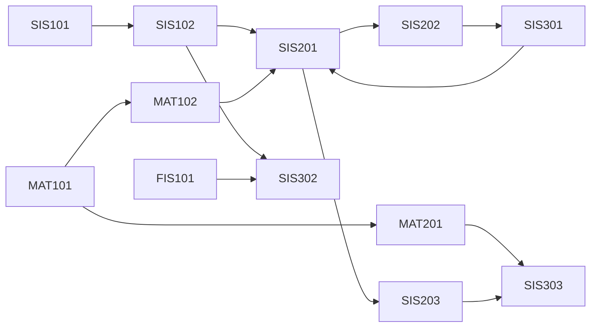

# Grafo de prerrequisitos

```mermaid
flowchart LR
    V0["SIS101"]
    V1["SIS102"]
    V2["MAT101"]
    V3["FIS101"]
    V4["MAT102"]
    V5["SIS201"]
    V6["MAT201"]
    V7["SIS202"]
    V8["SIS203"]
    V9["SIS301"]
    V10["SIS302"]
    V11["SIS303"]
    V0 --> V1
    V1 --> V5
    V1 --> V10
    V2 --> V4
    V2 --> V6
    V3 --> V10
    V4 --> V5
    V5 --> V7
    V5 --> V8
    V6 --> V11
    V7 --> V9
    V8 --> V11
    V9 --> V5
```
