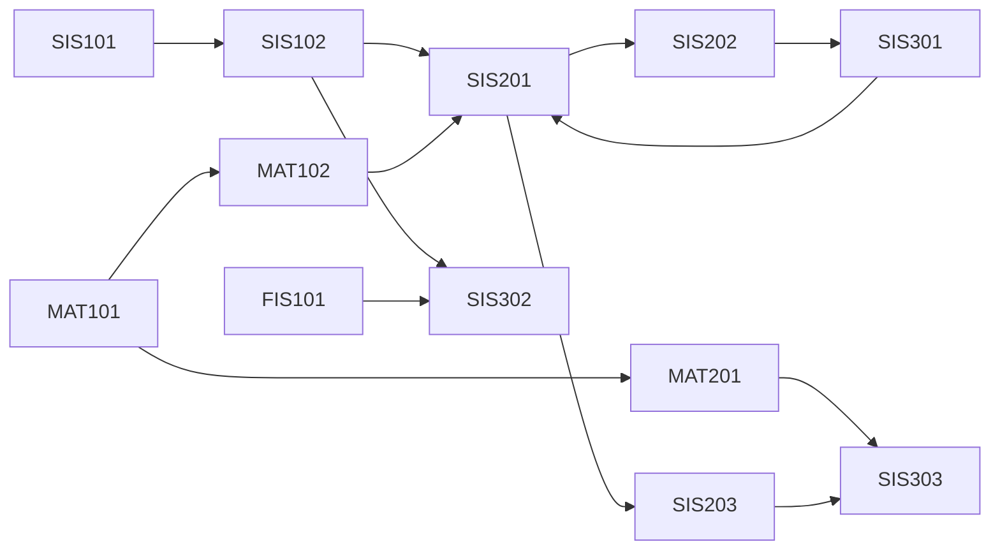

# Grafo de prerrequisitos

```mermaid
flowchart LR
    SIS101["SIS101"]
    SIS102["SIS102"]
    MAT101["MAT101"]
    FIS101["FIS101"]
    MAT102["MAT102"]
    SIS201["SIS201"]
    MAT201["MAT201"]
    SIS202["SIS202"]
    SIS203["SIS203"]
    SIS301["SIS301"]
    SIS302["SIS302"]
    SIS303["SIS303"]
    SIS101 --> SIS102
    SIS102 --> SIS201
    SIS102 --> SIS302
    MAT101 --> MAT102
    MAT101 --> MAT201
    FIS101 --> SIS302
    MAT102 --> SIS201
    SIS201 --> SIS202
    SIS201 --> SIS203
    MAT201 --> SIS303
    SIS202 --> SIS301
    SIS203 --> SIS303
    SIS301 --> SIS201
```
